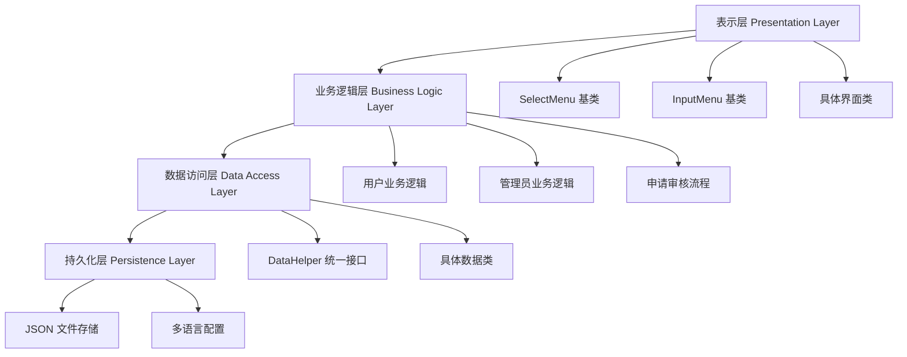

# 湖南大学宿舍管理系统

## 项目简介

本项目是湖南大学大一程序设计期末作业 - 宿舍管理系统（Dormitory Management System）。这是一个基于 C++ 开发的控制台应用程序，旨在通过数字化管理优化宿舍资源配置，提升管理效率和服务质量，为学生提供便捷的住宿服务体验。

## 项目特色

### 🎯 双角色权限管理
- **学生用户**：支持登录注册、申请入住/退宿、报修、查看宿舍信息、修改密码
- **管理员**：拥有审核申请、管理宿舍楼、处理维修请求、管理学生信息等高级权限

### 💾 JSON 文件存储，无需数据库
- 采用轻量级 JSON 格式进行数据持久化存储
- 降低部署复杂度，适合教学环境使用
- 数据文件位于 `data/data/` 目录，便于管理和备份

### 🌍 多语言界面支持
- 支持简体中文、英文、繁体中文等多种语言（可自定义）
- 语言配置文件位于 `data/lang/` 目录
- 运行时可动态切换语言界面

### ⚡ 哈希表优化的数据查询
- 使用 `unordered_map` 建立索引映射，实现 O(1) 时间复杂度的快速查询
- 通过 `locationIndexMap` 优化宿舍楼查找性能 

### 📋 完整的申请审核流程
- 学生提交申请 → 管理员审核 → 状态更新 → 结果通知
- 支持入住、退宿、维修等多种申请类型

### 🔒 密码哈希加密存储
- 使用 `HashHelper::simpleHashString()` 对密码进行加密存储 
- 确保用户数据安全性

## 运行方式

### 环境要求
- **开发工具**：CLion IDE
- **编译器**：支持 C++11 标准的编译器
- **构建系统**：CMake 4.0+
- **操作系统**：Windows（使用 Windows API）

### 编译运行格式化步骤

1. **克隆项目**
   ```bash
   git clone https://github.com/Skrepy0/Dormitory-Management-System.git
   cd Dormitory-Management-System
   ```

2. **使用 CLion 打开项目**
    - 启动 CLion
    - 选择 "Open" 并打开项目根目录
    - CLion 会自动检测 CMakeLists.txt 文件

3. **构建项目**
    - 在 CLion 中点击 "Build" 或使用快捷键 Ctrl+F9
    - 或者在命令行中：
   ```bash
   mkdir build
   cd build
   cmake ..
   make
   ```

4. **运行程序**
    - 在 CLion 中点击 "Run" 或使用快捷键 Shift+F10
    - 或者直接运行生成的可执行文件 `hnu_dms.exe`

5. **格式化代码**
    - pnpm配置
        - 安装 pnpm 和依赖
    ```bash
    # 安装 pnpm（如果尚未安装）  
    npm install -g pnpm
    # 安装项目依赖
    pnpm install
    ```
   - 使用js脚本工具进行项目的格式化代码
   ```bash
   pnpm format
   ```
   - 可以在.clang-format文件中修改代码格式化规则
### CMake 配置
项目使用 CMake 进行构建管理，配置文件 `CMakeLists.txt` 包含了所有源文件和依赖库的配置  。

## 项目结构

```
Dormitory-Management-System/
├── main.cpp                    # 主程序入口，创建 LoginSelectMenu 并启动主循环
├── CMakeLists.txt             # CMake 构建配置文件
├── README.md                  # 项目说明文档
├── INSTRUCTION.html           # ANSI 颜色代码说明文档
├── .clang-format              # 代码格式化配置
├── header/                    # 头文件目录
│   ├── data/                  # 数据管理相关头文件
│   │   ├── Accommodations.h   # 宿舍管理类，负责宿舍楼的增删改查
│   │   ├── UserData.h         # 用户数据类，提供用户信息管理接口
│   │   ├── StayLog.h          # 入住记录类，管理入住退宿记录
│   │   ├── DataHelper.h       # 数据访问统一接口，提供静态方法
│   │   ├── HashHelper.h       # 哈希加密工具类
│   │   ├── AdminData.h        # 管理员数据类
│   │   ├── BuildingData.h     # 楼栋数据类
│   │   └── basic/             # 基础数据结构
│   │       ├── Dormitory.h    # 宿舍房间对象
│   │       ├── Maintenance.h  # 维修记录对象
│   │       └── Time.h         # 时间处理类
│   ├── data/info/             # 信息处理相关
│   │   ├── Message.h          # 消息显示类，处理 ANSI 颜色代码
│   │   └── Text.h             # 文本管理类，支持多语言
│   └── screen/                # 界面管理相关头文件
│       ├── login/             # 登录系统
│       │   ├── LoginSelectMenu.h      # 登录选择菜单
│       │   ├── UserLoginInputMenu.h   # 用户登录界面
│       │   └── AdministratorLoginInputMenu.h # 管理员登录界面
│       ├── registry/          # 注册系统
│       │   ├── UserRegisterInputMenu.h # 用户注册界面
│       │   └── RegisterInputMenu.h    # 注册输入菜单
│       ├── operation/         # 操作菜单
│       │   ├── UserOperationMenu.h    # 用户操作主菜单
│       │   └── AdministratorOperationMenu.h # 管理员操作主菜单
│       └── operations/        # 具体操作实现
│           ├── administrator/  # 管理员操作
│           │   ├── AdminAccommodationReview.h # 住宿申请审核
│           │   ├── AdminDormitoryManagement.h # 宿舍管理
│           │   └── AdminMaintenanceReview.h   # 维修审核
│           └── user/          # 用户操作
│               ├── UserApplication.h      # 申请功能
│               └── UserMaintenance.h     # 维修功能
├── source/                    # 源文件目录（与 header 对应）
│   ├── data/                  # 数据管理实现
│   │   ├── library/          # 第三方库
│   │   │   └── json.hpp      # nlohmann/json 库
│   │   ├── Accommodations.cpp # 宿舍管理实现
│   │   ├── UserData.cpp       # 用户数据实现
│   │   ├── StayLog.cpp        # 入住记录实现
│   │   └── DataHelper.cpp     # 数据访问实现
│   ├── screen/                # 界面实现
│   │   ├── login/             # 登录界面实现
│   │   ├── operation/         # 操作界面实现
│   │   └── operations/        # 具体操作实现
│   └── data/info/             # 信息处理实现
│       ├── Message.cpp        # 消息显示实现
│       └── Text.cpp           # 文本管理实现
├── data/                      # 数据文件目录
│   ├── data/                  # JSON 数据文件
│   │   ├── UserData.json      # 用户账号信息（密码哈希加密）
│   │   ├── DormitoryData.json # 宿舍楼、房间、维修记录信息
│   │   ├── StayLog.json       # 入住/退宿申请记录
│   │   └── temp.json         # 临时会话文件
│   └── lang/                  # 多语言配置
│       ├── zh_cn.json         # 简体中文
│       ├── en_us.json         # 英文
│       └── zh_tw.json         # 繁体中文
└── scripts/                   # 工具脚本
    └── format-cpp.js          # 代码格式化脚本
```

## 具体功能

### 👤 用户功能

#### 基础功能
- **登录注册**：学生可以通过学号和密码登录系统，支持新用户注册
- **密码管理**：安全的密码修改功能，需要验证原密码

#### 申请功能
- **入住申请**：选择目标宿舍楼、房间和床位，填写申请理由
- **退宿申请**：提交退宿申请，说明退宿原因
- **报修申请**：提交宿舍设施维修申请，描述问题详情

#### 查询功能
- **宿舍信息查看**：查看个人分配的宿舍详细信息
- **申请状态查询**：实时查看各类申请的审核状态
- **维修记录查询**：查看历史维修记录和处理状态

### 👨‍💼 管理员功能

#### 宿舍管理
- **宿舍楼管理**：添加、删除、更新宿舍楼信息 
- **房间管理**：管理具体宿舍房间，包括床位分配
- **信息查询**：快速查找宿舍楼和房间信息

#### 申请审核
- **入住审核**：审核学生入住申请，批准后自动更新宿舍状态 
- **退宿审核**：处理学生退宿申请，释放床位资源 
- **维修处理**：分配维修人员，跟踪维修进度

#### 学生管理
- **信息查询**：查询学生基本信息和住宿记录
- **数据统计**：统计宿舍使用率和入住情况

### 🔧 系统功能

#### 多语言支持
- **语言切换**：运行时动态切换界面语言
- **本地化配置**：所有界面文本支持多语言 

#### 数据持久化
- **自动保存**：所有操作实时保存到 JSON 文件
- **数据备份**：支持手动备份和恢复数据
- **会话管理**：使用临时文件管理用户会话状态

## 技术实现

### 🏗️ 系统架构

系统采用四层架构设计：



### 💾 数据存储方式

#### JSON 文件结构
- **UserData.json**：存储用户账号信息，包含用户基本信息和宿舍分配情况
- **DormitoryData.json**：存储宿舍楼、房间和维修记录的层级结构数据
- **StayLog.json**：存储所有入住退宿申请的完整记录

#### 数据访问模式
采用 Facade 模式，通过 `DataHelper` 类提供统一的数据访问接口  ，简化上层业务逻辑的数据操作。

### 🔐 密码加密机制

使用 `HashHelper::simpleHashString()` 方法对用户密码进行哈希加密  ：

```cpp
// 密码加密存储示例
newData["password"] = HashHelper::simpleHashString(password);
```

确保用户密码在存储和传输过程中的安全性。

### ⚡ 查询优化

#### 哈希表索引
使用 `unordered_map` 建立多种索引映射：
- `locationIndexMap`：位置索引
- `nameIndexMap`：名称索引
- `numberIndexMap`：编号索引

实现 O(1) 时间复杂度的快速查询  。

#### 申请记录查找
通过 `findStayLogByHash()` 方法根据哈希值快速定位申请记录  。

### 🎨 界面渲染

#### ANSI 颜色代码
系统使用自定义的格式化代码系统，支持丰富的颜色和样式：

```cpp
// 颜色代码示例
"login.title": "\t$cH$AN$DU$y$l学生宿舍管理系统\n\n$r"
```

支持的颜色包括：
- 文本颜色：红、绿、蓝、黄、紫、青等
- 文本样式：加粗、下划线、删除线、斜体、闪烁等
- 背景颜色：多种背景色选择

详细颜色代码参考 `INSTRUCTION.html` 文档。

#### 多语言渲染
通过 `Text` 类和 `Message` 类实现多语言文本的动态加载和渲染  。

### 🔧 核心算法

#### 登录认证流程
1. 用户输入学号/账号和密码
2. 调用 `UserData::findUserById()` 查找用户 
3. 使用 `HashHelper::simpleHashString()` 验证密码
4. 创建会话记录到 `temp.json`
5. 跳转到对应角色的操作界面

#### 申请审核流程
1. 学生提交申请，生成唯一哈希标识
2. 管理员查看待审核列表
3. 审核通过后更新宿舍状态和用户信息
4. 记录操作日志到 `StayLog.json`

## 自定义颜色代码系统使用指南

### 系统概述

宿舍管理系统采用了一套自定义的颜色代码系统，通过简单的 `$` 符号加单字符代码来实现丰富的文本样式和颜色效果。这套系统基于 ANSI 转义序列，为控制台应用程序提供了美观的界面渲染能力。
### 核心特性

#### 🎨 丰富的颜色支持
- **16种文本颜色**：从基础的红绿蓝到高级的橙色、粉色、紫罗兰色
- **7种背景颜色**：红、绿、黄、蓝、紫、青、白背
- **多种文本样式**：加粗、下划线、删除线、斜体、闪烁、反显
#### ⚡ 简洁的使用方式
- 单字符代码，易于记忆和使用
- 支持组合样式
- 自动重置机制，避免样式污染
#### 🌐 多语言兼容
- 与多语言系统完美集成
- 支持转义字符，可显示 `$` 符号本身
### 颜色代码参考表
- 见`INSTRUCTION.html`

### 使用方法

#### 基础用法

```cpp  
// 在语言文件中使用  
"login.title": "\t$cH$AN$DU$y$l学生宿舍管理系统\n\n$r"  
```  

#### 转义字符

如果需要显示 `$` 符号本身而不是作为颜色代码，使用转义：

```cpp  
"example": "这是\\$符号，不是颜色代码"  
```  

#### 实际应用示例

从项目中的语言文件可以看到丰富的使用实例： 

```json  
{  
  "login.title": "\t$cH$AN$DU$y$l学生宿舍管理系统\n\n$r",  
  "login.option.user": "\uD83D\uDD26$A用户$r登录\n$r",  
  "login.option.administrator": "\uD83D\uDD27$G管理员$r登录\n$r",  
  "screen.InputMenu.showSuccess": "✅ ",  
  "screen.InputMenu.showError": "❌ "  
}  
```  
### 技术实现

#### 颜色映射机制

系统使用 `COLOR_MAP` 将单字符代码映射到 ANSI 转义序列： 

```cpp  
const std::unordered_map<char, std::string> COLOR_MAP = {  
    {'c', "\033[31m"},  // 红色  
    {'a', "\033[32m"},  // 绿色  
    {'l', "\03
```
#### 解析处理流程

`Message::printContent()` 方法负责解析和渲染颜色代码： 

1. **转义处理**：识别 `\$` 并输出普通 `$` 字符
   **颜色代码解析**：识别 `$` + 字符组合，查找对应 `ANSI` 代码
   **普通字符输出**：直接输出其他字符
   **Windows 支持**：启用 `ANSI` 虚拟终端处理

#### 跨平台兼容性

系统确保在不同平台上的兼容性： 

```cpp  
#ifdef _WIN32  
void enableWindowsAnsiSupport() {  
    HANDLE hOut = GetStdHandle(STD_OUTPUT_HANDLE);  
    DWORD mode = 0;  
    GetCons
```

### 最佳实践

#### 1. 颜色搭配建议
- **错误信息**：使用红色系 (`$c`, `$m`, `$8`)

- **成功信息**：使用绿色系 (`$a`, `$k`, `$9`)

- **警告信息**：使用黄色系 (`$y`, `$D`, `$o`)

- **普通信息**：使用蓝色或青色 (`$b`, `$p`)

- **标题强调**：使用加粗 (`$l`) 配合醒目颜色
#### 2. 性能考虑
- 颜色代码解析是线性时间复杂度，性能良好
- 建议在字符串末尾添加 $r 重置样式
- 避免过度使用闪烁效果，可能影响用户体验

#### 3. 维护性
- 保持颜色代码的一致性使用
- 在团队中建立颜色使用规范
- 定期检查颜色在不同终端的显示效果

## 开发说明

### 代码规范
- 遵循良好的命名规范和注释规范
- 使用 `.clang-format` 进行代码格式化
- 采用面向对象设计，合理使用继承和多态

### 异常处理
- 对文件读写错误进行异常处理
- 输入验证和错误提示
- 系统稳定性保障

### 扩展性
- 模块化设计，便于功能扩展
- 插件式的多语言支持
- 灵活的数据访问接口

### 代码行数统计
- 使用 `scripts/analysis.py` 统计代码行数
- 目前项目行数**6809行**（.json, .cpp, .h）

---

**项目地址**：https://github.com/Skrepy0/Dormitory-Management-System

**开发者**：[Skrepy2233](https://github.com/Skrepy0), [Bully-NK](https://github.com/Bully-NK)

**项目结构解析**：https://app.devin.ai/wiki/Skrepy0/Dormitory-Management-System

---
